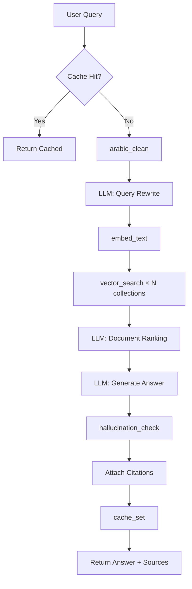
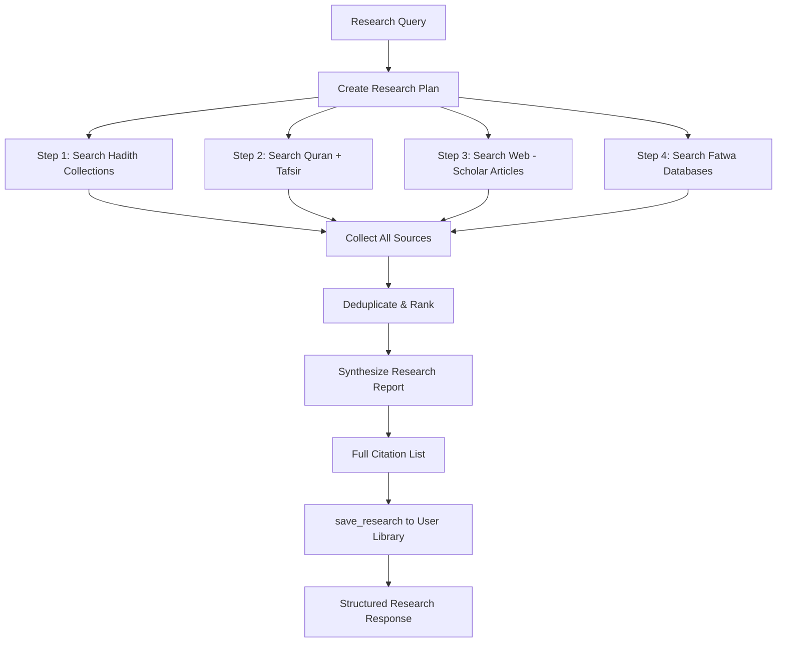
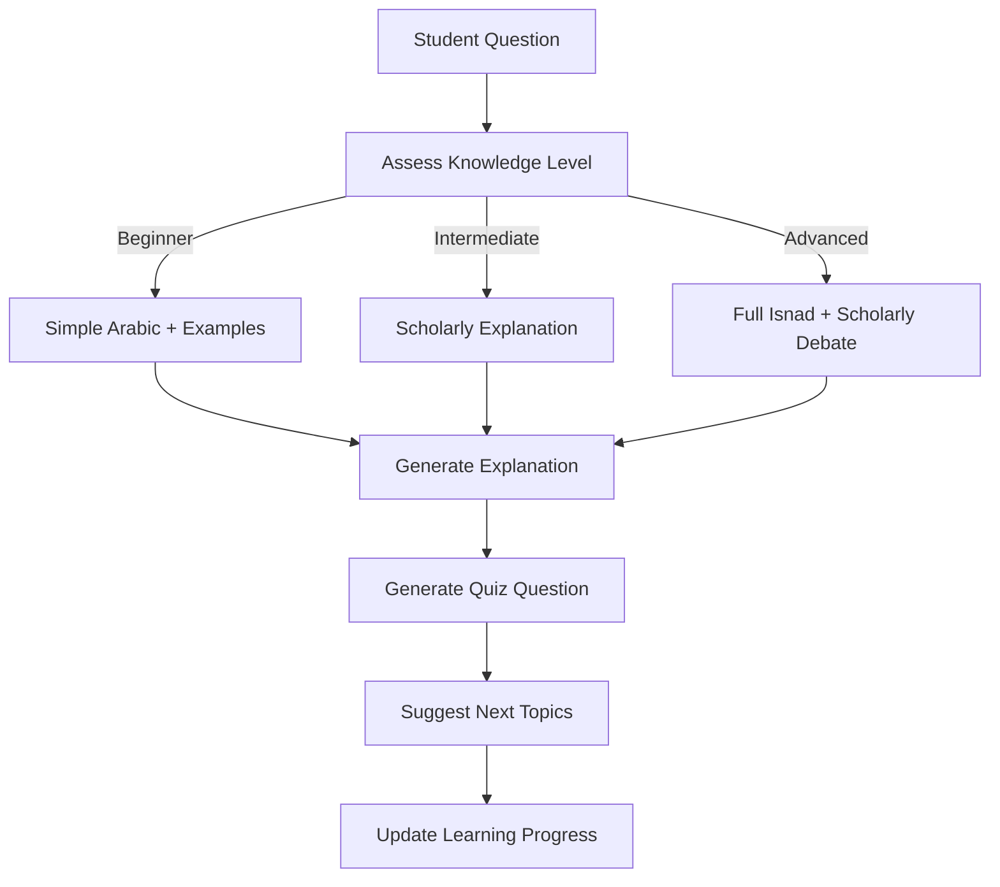
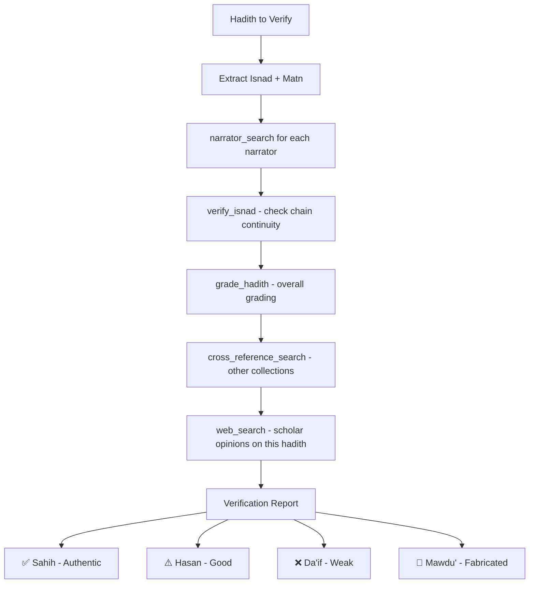
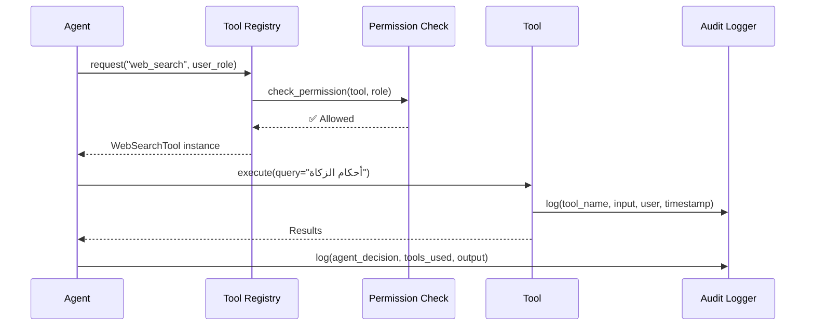
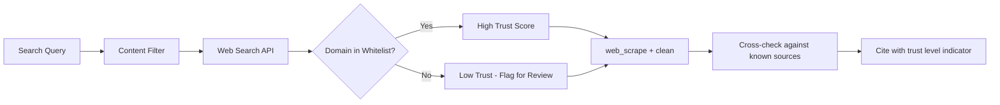
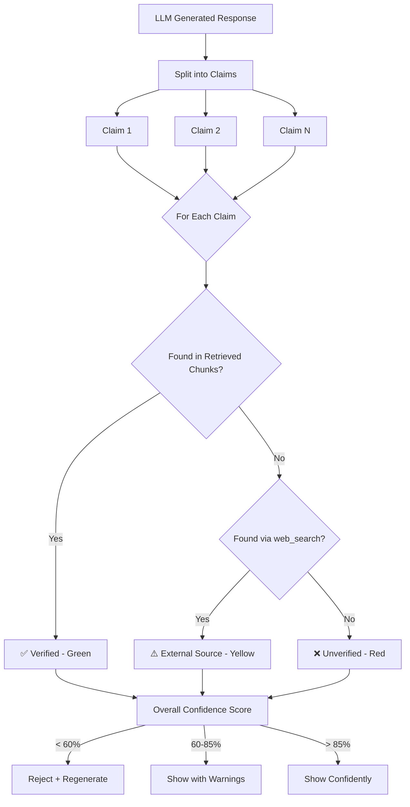

# 🤖 Mishkat Agentic AI — Deep Architecture & Tool System

---

## 1. Agent Orchestration Architecture

```mermaid
flowchart TD
    USER[User Message] --> SUPERVISOR{Supervisor Agent}
    
    SUPERVISOR -->|Route| RAG[RAG Agent]
    SUPERVISOR -->|Route| RESEARCH[Research Agent]
    SUPERVISOR -->|Route| COMPARE[Comparative Fiqh Agent]
    SUPERVISOR -->|Route| TUTOR[Tutor Agent]
    SUPERVISOR -->|Route| VERIFY[Verification Agent]
    SUPERVISOR -->|Route| CLEAN[Data Cleaning Agent]
    SUPERVISOR -->|Route| INGEST[Ingestion Agent]
    SUPERVISOR -->|Route| TRANSLATE[Translation Agent]
    SUPERVISOR -->|Route| SUMMARY[Summarization Agent]
    
    subgraph TOOLBOX["🧰 Shared Tool Registry (30+ Tools)"]
        direction LR
        T1[Web Search]
        T2[Vector Search]
        T3[MongoDB Query]
        T4[Text Cleaning]
        T5[Embedding]
        T6[LLM Generate]
        T7[Translate]
        T8[PDF Parse]
        T9[Isnad Lookup]
        T10[Hadith Grade]
        T11[Scholar DB]
        T12[Cache R/W]
        T13[Quran Search]
        T14[Tafsir Lookup]
        T15[..."+ 16 more"]
    end
    
    RAG & RESEARCH & COMPARE & TUTOR & VERIFY & CLEAN & INGEST & TRANSLATE & SUMMARY --> TOOLBOX
```

The **Supervisor Agent** is the brain — it reads the user's intent, selects the right specialist agent, and that agent autonomously picks which tools to call and in what order.

---

## 2. Complete Tool Registry (30+ Tools)

### 2.1 🔍 Search & Retrieval Tools

| # | Tool Name | Input | Output | Description |
|---|-----------|-------|--------|-------------|
| 1 | `vector_search` | query text, collection, limit, filters | Ranked chunks with scores | Semantic search across Qdrant collections |
| 2 | `keyword_search` | keywords, collection, filters | Matching documents | Traditional BM25/text search in MongoDB |
| 3 | `web_search` | query, language, num_results | URLs + snippets | Search the internet via SerpAPI/Tavily for fatwa sites, Islamic encyclopedias |
| 4 | `web_scrape` | URL | Cleaned text content | Extract and clean text from a web page |
| 5 | `quran_search` | surah, ayah, or semantic query | Ayah text + translation | Search Quran verses by reference or meaning |
| 6 | `tafsir_lookup` | surah:ayah, tafsir_source | Tafsir text | Get explanation from Ibn Kathir, Tabari, etc. |
| 7 | `hadith_by_number` | collection, book, number | Full hadith record | Direct lookup by hadith numbering system |
| 8 | `cross_reference_search` | hadith_id | Related hadiths from other collections | Find same hadith narrated in other books |
| 9 | `narrator_search` | narrator_name | Narrator bio + grading | Search the Rijal (narrator) database |
| 10 | `fatwa_search` | topic, madhab, scholar | Relevant fatwas | Search major fatwa databases |

### 2.2 📝 Text Processing Tools

| # | Tool Name | Input | Output | Description |
|---|-----------|-------|--------|-------------|
| 11 | `arabic_clean` | raw Arabic text | Cleaned text | Strip tashkeel, normalize alef/hamza/ta-marbuta, remove URLs |
| 12 | `arabic_diacritize` | undiacritized text | Fully diacritized text | Add tashkeel back using Mishkal/CAMeL |
| 13 | `transliterate` | Arabic text | Romanized text | Arabic → Buckwalter or simple Roman |
| 14 | `translate_text` | text, source_lang, target_lang | Translated text | Translate between Arabic/English/Urdu/French/Turkish/Malay |
| 15 | `summarize_text` | long text, max_length | Summary | Concise summary preserving Islamic terminology |
| 16 | `extract_keywords` | text | Keywords + entities | Extract Islamic terms, names, topics |
| 17 | `detect_language` | text | Language code + confidence | Detect input language |
| 18 | `chunk_text` | text, chunk_size, overlap | List of chunks | Split text using RecursiveCharacterTextSplitter |
| 19 | `parse_pdf` | PDF file/URL | Extracted text + metadata | Parse Islamic manuscripts and books |
| 20 | `parse_html` | HTML content | Clean markdown | Convert web pages to clean text |

### 2.3 🔬 Analysis & Verification Tools

| # | Tool Name | Input | Output | Description |
|---|-----------|-------|--------|-------------|
| 21 | `verify_isnad` | chain of narrators | Grading + weak links | Analyze narrator chain for authenticity |
| 22 | `grade_hadith` | hadith text or ID | Grade (Sahih/Hasan/Da'if/Mawdu') + reasoning | Check hadith authenticity |
| 23 | `compare_narrations` | 2+ hadith texts | Diff analysis | Find textual differences between narrations |
| 24 | `topic_classify` | text | Topic labels + confidence | Classify into Islamic topic taxonomy (Fiqh, Aqeedah, Seerah, etc.) |
| 25 | `sentiment_analyze` | text | Ruling type (command/prohibition/recommendation) | Detect if hadith is amr, nahy, or mubah |
| 26 | `hallucination_check` | LLM response, source chunks | Verified claims + flagged fabrications | Cross-validate every claim against sources |

### 2.4 💾 Data & Storage Tools

| # | Tool Name | Input | Output | Description |
|---|-----------|-------|--------|-------------|
| 27 | `cache_get` | cache_key | Cached value or null | Read from Redis cache |
| 28 | `cache_set` | cache_key, value, TTL | Success | Write to Redis cache |
| 29 | `save_research` | user_id, title, content | Research document ID | Save user's research to their library |
| 30 | `get_chat_history` | chat_id, limit | Recent messages | Retrieve conversation context |
| 31 | `log_interaction` | query, response, tools_used, latency | Log entry | Audit log for analytics |
| 32 | `embed_text` | text | 1024-dim vector | Generate BGE-M3 embedding |
| 33 | `store_vector` | vector, metadata, collection | Point ID | Insert into Qdrant |

### 2.5 🌐 External API Tools

| # | Tool Name | Input | Output | Description |
|---|-----------|-------|--------|-------------|
| 34 | `call_islamqa` | question | Answer + source | Query IslamQA API |
| 35 | `call_sunnah_api` | collection, hadith_num | Hadith in Arabic + English | Query sunnah.com API |
| 36 | `call_quran_api` | surah, ayah | Ayah + translations | Query quran.com API |
| 37 | `call_prayer_times` | city, date | Prayer times | Get prayer times for context |
| 38 | `call_hijri_calendar` | gregorian_date | Hijri date | Convert dates for Islamic context |

---

## 3. Agent Specifications

### 3.1 🧠 Supervisor Agent (Router)

```python
# Pseudocode — LangGraph Supervisor
class SupervisorAgent:
    """
    Analyzes user intent and routes to the best specialist agent.
    Can also chain multiple agents for complex queries.
    """
    
    def route(self, user_message, chat_history):
        # Tools available to supervisor:
        # - detect_language
        # - topic_classify  
        # - get_chat_history
        
        # Returns: which agent(s) to invoke, in what order
        # Can do PARALLEL routing (e.g., Research + Verify simultaneously)
        # Can do SEQUENTIAL routing (e.g., Clean → Ingest → Verify)
```

**Routing Examples:**

| User Says | Routed To | Why |
|-----------|-----------|-----|
| "ما حكم صلاة الجمعة؟" | RAG Agent | Simple factual Q&A |
| "قارن بين حكم المالكية والحنفية في المسح على الخفين" | Comparative Agent | Multi-madhab comparison |
| "اشرح لي أحاديث الصيام كأنني مبتدئ" | Tutor Agent | Adaptive learning request |
| "هل هذا الحديث صحيح: ..." | Verification Agent | Authenticity check |
| "ابحث عن كل ما يتعلق بالربا في السنة والقرآن" | Research Agent | Deep multi-source research |
| "نظف هذا النص وأضفه للقاعدة" | Data Cleaning Agent | Admin data operation |
| "ترجم هذا الحديث إلى الإنجليزية" | Translation Agent | Translation task |

---

### 3.2 📖 RAG Agent (Enhanced)

**Tools:** `vector_search`, `keyword_search`, `arabic_clean`, `embed_text`, `cache_get`, `cache_set`, `hadith_by_number`, `hallucination_check`



**What's new vs your current system:**
- ✅ Caching layer (Redis) — repeated questions answered instantly
- ✅ Hallucination check — every claim verified against source chunks
- ✅ Multi-collection parallel search
- ✅ Auto-citation with book/chapter/number

---

### 3.3 🔬 Research Agent

**Tools:** `vector_search`, `web_search`, `web_scrape`, `quran_search`, `tafsir_lookup`, `cross_reference_search`, `narrator_search`, `fatwa_search`, `summarize_text`, `save_research`



**Example Interaction:**
```
User: "أريد بحثاً شاملاً عن أحكام الربا في الإسلام"

Agent Plan:
1. [vector_search] → Search "الربا" across Bukhari, Muslim, Abu Dawud
2. [quran_search] → Find Quran verses about Riba (Al-Baqarah:275-279, Aal-Imran:130)
3. [tafsir_lookup] → Get Ibn Kathir's explanation for each verse
4. [web_search] → "أحكام الربا في الفقه الإسلامي site:islamqa.info"
5. [web_scrape] → Extract top 3 articles
6. [fatwa_search] → Contemporary fatwa on modern banking
7. [cross_reference_search] → Link hadiths across collections
8. [summarize_text] → Create structured report
9. [save_research] → Save to user's library

Output: 15-section research report with 40+ citations
```

---

### 3.4 ⚖️ Comparative Fiqh Agent

**Tools:** `vector_search`, `web_search`, `fatwa_search`, `translate_text`, `topic_classify`

Specializes in comparing rulings across the 4 madhabs (Hanafi, Maliki, Shafi'i, Hanbali).

**Output Format:**
```markdown
## Topic: حكم المسح على الخفين

| المذهب | الحكم | الدليل | المصدر |
|--------|-------|--------|--------|
| الحنفي | جائز بشروط | حديث المغيرة بن شعبة | البخاري 203 |
| المالكي | جائز للمسافر | ... | ... |
| الشافعي | جائز يوم وليلة | ... | ... |
| الحنبلي | جائز مطلقاً | ... | ... |

### إجماع العلماء: ...
### الراجح: ...
```

---

### 3.5 🎓 Tutor Agent

**Tools:** `vector_search`, `quran_search`, `translate_text`, `summarize_text`, `topic_classify`, `cache_get`, `cache_set`



**Adaptive Features:**
- Detects student level from conversation history
- Adjusts vocabulary and depth accordingly
- Generates practice quizzes
- Tracks learning progress per topic
- Suggests next topics in a curriculum order

---

### 3.6 ✅ Verification Agent

**Tools:** `verify_isnad`, `grade_hadith`, `narrator_search`, `cross_reference_search`, `web_search`, `call_sunnah_api`, `compare_narrations`



**Output Example:**
```
📋 Hadith Verification Report
━━━━━━━━━━━━━━━━━━━━━━━━━━━━

📌 Hadith: "طلب العلم فريضة على كل مسلم"
📊 Grade: ضعيف (Da'if) — Weak

🔗 Chain Analysis:
  ├── أنس بن مالك ✅ (Sahabi - Trustworthy)
  ├── حفص بن سليمان ❌ (Weak narrator - Ibn Hajar: متروك)
  └── Chain: منقطع (Disconnected)

📚 Cross-References:
  • ابن ماجه: 224 (same chain, same weakness)
  • البيهقي: شعب الإيمان (different chain, still weak)

👨‍🏫 Scholar Opinions:
  • الألباني: ضعيف (Silsilah Da'ifah: 416)
  • ابن حجر: ضعيف من جميع طرقه
  
⚠️ Note: Despite weakness, the MEANING is supported 
   by stronger hadiths about seeking knowledge.
```

---

### 3.7 🧹 Data Cleaning Agent

**Tools:** `arabic_clean`, `arabic_diacritize`, `detect_language`, `extract_keywords`, `chunk_text`, `embed_text`, `store_vector`, `translate_text`, `parse_pdf`, `parse_html`

For admin use — processes raw Islamic texts into clean, searchable data.

**Capabilities:**
| Task | Tools Used |
|------|-----------|
| Clean raw Arabic OCR text | `arabic_clean` + `arabic_diacritize` |
| Extract hadiths from PDF books | `parse_pdf` + `extract_keywords` + `chunk_text` |
| Scrape and clean web sources | `web_scrape` + `parse_html` + `arabic_clean` |
| Auto-tag topics | `topic_classify` + `extract_keywords` |
| Generate embeddings for new data | `chunk_text` + `embed_text` + `store_vector` |
| Detect and fix encoding issues | `detect_language` + `arabic_clean` |
| Deduplicate hadiths | `embed_text` + similarity comparison |

---

### 3.8 🌍 Translation Agent

**Tools:** `translate_text`, `transliterate`, `detect_language`, `arabic_diacritize`, `quran_search`, `hadith_by_number`

**Supported Languages:** Arabic, English, Urdu, French, Turkish, Malay, Indonesian, Bengali

**Features:**
- Preserves Islamic terminology (keeps "Salah" not "prayer" when appropriate)
- Adds transliteration for Arabic terms
- Cross-references existing professional translations (e.g., Muhsin Khan for Bukhari)
- Handles Quranic Arabic differently from modern Arabic

---

### 3.9 📊 Summarization Agent

**Tools:** `vector_search`, `summarize_text`, `topic_classify`, `extract_keywords`, `save_research`

**Use Cases:**
- Summarize an entire chapter of hadith
- Create study notes from a long conversation
- Generate topic overviews (e.g., "All hadiths about patience")
- Create comparison tables across topics

---

## 4. Tool Implementation Architecture

### 4.1 Tool Registry Pattern

```python
# tools/registry.py
class ToolRegistry:
    """Central registry — agents request tools by name."""
    
    tools = {
        "vector_search": VectorSearchTool,
        "web_search": WebSearchTool,
        "arabic_clean": ArabicCleanTool,
        "verify_isnad": IsnadVerifyTool,
        # ... 30+ tools
    }
    
    def get(self, name: str, permissions: list) -> Tool:
        tool = self.tools[name]
        if tool.required_role not in permissions:
            raise PermissionError(f"Role lacks access to {name}")
        return tool
```

### 4.2 Tool Permission Matrix

| Tool | Guest | Student | Scholar | Admin |
|------|-------|---------|---------|-------|
| `vector_search` | ✅ | ✅ | ✅ | ✅ |
| `web_search` | ❌ | ✅ | ✅ | ✅ |
| `web_scrape` | ❌ | ❌ | ✅ | ✅ |
| `verify_isnad` | ❌ | ✅ | ✅ | ✅ |
| `store_vector` | ❌ | ❌ | ❌ | ✅ |
| `parse_pdf` | ❌ | ❌ | ✅ | ✅ |
| `cache_set` | ❌ | ❌ | ❌ | ✅ |
| `save_research` | ❌ | ✅ | ✅ | ✅ |

### 4.3 Tool Execution Flow



---

## 5. Multi-Agent Chaining Examples

### Example 1: Complex Research Query
```
User: "اجمع لي كل الأحاديث عن الصدقة مع التخريج والترجمة الإنجليزية"

Supervisor → chains 3 agents:

1. Research Agent:
   ├── vector_search("الصدقة", collection="bukhari")
   ├── vector_search("الصدقة", collection="muslim")  
   ├── cross_reference_search(results)
   └── fatwa_search("فضل الصدقة")

2. Verification Agent (parallel):
   ├── verify_isnad(each_hadith)
   ├── grade_hadith(each_hadith)
   └── narrator_search(narrators)

3. Translation Agent (after 1+2 complete):
   ├── translate_text(each_hadith, "en")
   ├── transliterate(arabic_terms)
   └── save_research(final_report)
```

### Example 2: Data Pipeline (Admin)
```
Admin: "أضف كتاب رياض الصالحين من هذا الملف PDF"

Supervisor → chains:

1. Data Cleaning Agent:
   ├── parse_pdf(uploaded_file)
   ├── arabic_clean(extracted_text)
   ├── detect_language(pages)  
   ├── extract_keywords(each_hadith)
   └── topic_classify(each_hadith)

2. Ingestion Agent:
   ├── chunk_text(cleaned_hadiths)
   ├── embed_text(chunks)
   ├── store_vector(embeddings, "riyad_alsalihin")
   └── log_interaction(stats)
```

### Example 3: Student Learning Session
```
Student: "علمني عن أركان الصلاة"

Supervisor → Tutor Agent:
   ├── cache_get(student_progress)           # Check where they left off
   ├── topic_classify("أركان الصلاة")        # Classify topic
   ├── vector_search("أركان الصلاة فرائض")  # Find relevant hadiths
   ├── quran_search("أقيموا الصلاة")         # Find Quran verses
   ├── summarize_text(sources)               # Simplified explanation
   ├── [Generate quiz question]              # Test understanding
   ├── cache_set(updated_progress)           # Save progress
   └── [Suggest: "Next: شروط الصلاة"]       # Curriculum path
```

---

## 6. Web Search Integration Detail

### 6.1 Search Providers

| Provider | Use Case | Rate Limit |
|----------|----------|------------|
| **Tavily** | General Islamic web search | 1000/day |
| **SerpAPI** | Google search results | 100/day |
| **Custom Crawler** | islamqa.info, sunnah.com, quran.com | Cached |

### 6.2 Trusted Domain Whitelist

```python
TRUSTED_ISLAMIC_DOMAINS = [
    "islamqa.info",        # Scholar Q&A
    "sunnah.com",          # Hadith database
    "quran.com",           # Quran text
    "islamweb.net",        # Fatwa database
    "dorar.net",           # Hadith verification (الدرر السنية)
    "alifta.gov.sa",       # Saudi fatwa authority
    "dar-alifta.org",      # Egyptian fatwa authority
    "al-maktaba.org",      # Islamic library
    "shamela.ws",          # المكتبة الشاملة
    "islamway.net",        # Islamic articles
]
```

### 6.3 Web Search Safety



---

## 7. Hallucination Prevention System



Each response gets a **trust badge**:
- 🟢 **Verified** (>85%) — All claims traced to authentic sources
- 🟡 **Partially Verified** (60-85%) — Some claims need confirmation  
- 🔴 **Low Confidence** (<60%) — Flagged for scholar review

---

## 8. Agent Memory System

| Memory Type | Storage | TTL | Purpose |
|-------------|---------|-----|---------|
| **Short-term** | Redis | Session | Current conversation context |
| **Working** | In-process | Request | Tools used, intermediate results |
| **Long-term** | MongoDB | Permanent | User preferences, learning progress |
| **Semantic** | Qdrant | Permanent | Past research embeddings for retrieval |
| **Episodic** | MongoDB | 90 days | Past conversations summarized |

---

## 9. Frontend Agent UI Components

| Component | Description |
|-----------|-------------|
| **Agent Selector** | User can pick specific agent or let Supervisor auto-route |
| **Tool Activity Feed** | Live feed showing which tools the agent is calling |
| **Citation Cards** | Expandable cards showing source hadith with full metadata |
| **Confidence Badge** | Green/Yellow/Red trust indicator on every response |
| **Research Library** | Saved research reports with full citations |
| **Learning Dashboard** | Progress tracker for Tutor Agent sessions |
| **Verification Report** | Detailed isnad analysis visualization |
| **Comparison Table** | Side-by-side madhab comparison view |

---

## 10. Priority Implementation Order

| Phase | What | Tools Added |
|-------|------|-------------|
| **Phase 1** | Enhanced RAG Agent | `vector_search`, `arabic_clean`, `embed_text`, `cache_get/set`, `hallucination_check` |
| **Phase 2** | Web + External APIs | `web_search`, `web_scrape`, `call_sunnah_api`, `call_quran_api`, `quran_search` |
| **Phase 3** | Verification Agent | `verify_isnad`, `grade_hadith`, `narrator_search`, `cross_reference_search` |
| **Phase 4** | Research Agent | `fatwa_search`, `tafsir_lookup`, `summarize_text`, `save_research` |
| **Phase 5** | Data Cleaning Agent | `parse_pdf`, `parse_html`, `chunk_text`, `store_vector`, `topic_classify` |
| **Phase 6** | Tutor + Translation | `translate_text`, `transliterate`, `arabic_diacritize`, learning tracker |
