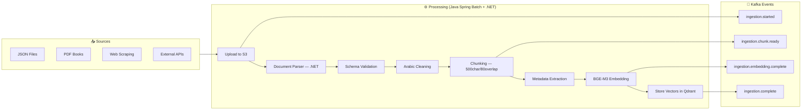

# 🕌 Mishkat Platform — Final Engineering Blueprint (Part 2/2)
## Tools · References · DevOps · Frontend · Optimizations · Roadmap

> **Part 1** covers: Current State, Target Architecture, Tech Stack, Security, and Agent System  
> **Part 2** covers: Tool Registry, Reference System, DevOps, Frontend, Optimizations, and Roadmap

---

## 6. Complete Tool Registry (38 Tools)

### 6.1 🔍 Search & Retrieval (10 tools)

| # | Tool | Input → Output | Used By |
|---|------|----------------|---------|
| 1 | `vector_search` | query, collection, limit, filters → ranked chunks with scores | RAG, Research, Compare, Tutor |
| 2 | `keyword_search` | keywords, collection → matching documents | RAG, Research |
| 3 | `web_search` | query, language, num_results → URLs + snippets (via Tavily/SerpAPI) | Research, Compare, Verify, General |
| 4 | `web_scrape` | URL → cleaned text | Research, Cleaning |
| 5 | `quran_search` | surah:ayah or semantic query → ayah text + translation | Research, Compare, Tutor |
| 6 | `tafsir_lookup` | surah:ayah, tafsir_source → explanation text | Research, Tutor |
| 7 | `hadith_by_number` | collection, book, number → full hadith record | RAG, Verify, Research |
| 8 | `cross_reference_search` | hadith_id → same hadith in other collections | Research, Verify |
| 9 | `narrator_search` | narrator_name → bio, grading, teachers, students | Verify |
| 10 | `fatwa_search` | topic, madhab → relevant scholarly opinions | Research, Compare |

### 6.2 📝 Text Processing (10 tools)

| # | Tool | Input → Output | Used By |
|---|------|----------------|---------|
| 11 | `arabic_clean` | raw text → normalized (strip tashkeel, normalize alef/hamza) | RAG, Cleaning, all |
| 12 | `arabic_diacritize` | undiacritized → fully voweled text (via Mishkal/CAMeL) | Cleaning, Translation |
| 13 | `transliterate` | Arabic text → Buckwalter or simple Roman | Translation |
| 14 | `translate_text` | text, src, tgt → translated (AR/EN/UR/FR/TR/MS/ID/BN) | Translation, Research |
| 15 | `summarize_text` | long text, max_len → concise summary | Summary, Research, Tutor |
| 16 | `extract_keywords` | text → Islamic terms, named entities, topics | Cleaning, Summary |
| 17 | `detect_language` | text → language code + confidence | Supervisor, Translation |
| 18 | `chunk_text` | text, size, overlap → chunks (RecursiveCharacterTextSplitter) | Cleaning |
| 19 | `parse_pdf` | PDF file → extracted text + metadata | Cleaning |
| 20 | `parse_html` | HTML → clean markdown | Cleaning, Research |

### 6.3 🔬 Analysis & Verification (6 tools)

| # | Tool | Input → Output | Used By |
|---|------|----------------|---------|
| 21 | `verify_isnad` | narrator chain → grading + weak links identified | Verify |
| 22 | `grade_hadith` | hadith text/ID → Sahih/Hasan/Da'if/Mawdu' + reasoning | Verify, Research |
| 23 | `compare_narrations` | 2+ hadith texts → textual diff analysis | Verify, Compare |
| 24 | `topic_classify` | text → Islamic topic labels (Fiqh/Aqeedah/Seerah/etc.) | Supervisor, Cleaning, Summary |
| 25 | `sentiment_analyze` | text → ruling type (command/prohibition/recommendation) | Research, Compare |
| 26 | `hallucination_check` | LLM response + source chunks → verified/flagged claims | RAG (mandatory) |

### 6.4 💾 Data & Storage (7 tools)

| # | Tool | Input → Output | Used By |
|---|------|----------------|---------|
| 27 | `cache_get` | key → cached value or null | RAG, Tutor |
| 28 | `cache_set` | key, value, TTL → success | RAG, Tutor |
| 29 | `save_research` | user_id, title, content → document ID | Research, Summary |
| 30 | `get_chat_history` | chat_id, limit → recent messages | RAG, Tutor, General |
| 31 | `log_interaction` | query, response, tools, latency → audit entry | All agents |
| 32 | `embed_text` | text → 1024-dim BGE-M3 vector | RAG, Cleaning |
| 33 | `store_vector` | vector, metadata, collection → point ID | Cleaning |

### 6.5 🌐 External APIs (5 tools)

| # | Tool | Input → Output | Used By |
|---|------|----------------|---------|
| 34 | `call_islamqa` | question → answer + scholarly source | Research, Compare |
| 35 | `call_sunnah_api` | collection, number → hadith (AR + EN) from sunnah.com | Verify, Translation |
| 36 | `call_quran_api` | surah, ayah → text + multiple translations from quran.com | Research, Tutor |
| 37 | `call_prayer_times` | city, date → prayer schedule | General (contextual) |
| 38 | `call_hijri_calendar` | date → Hijri conversion | General (contextual) |

### 6.6 Tool Permission Matrix

| Tool Category | 👤 Guest | 🎓 Student | 📚 Scholar | 🔑 Admin |
|--------------|----------|-----------|-----------|---------|
| `vector_search`, `keyword_search` | ✅ | ✅ | ✅ | ✅ |
| `web_search`, `web_scrape` | ❌ | ✅ | ✅ | ✅ |
| `quran_search`, `tafsir_lookup`, `hadith_by_number` | ✅ | ✅ | ✅ | ✅ |
| `verify_isnad`, `grade_hadith`, `narrator_search` | ❌ | ✅ | ✅ | ✅ |
| `translate_text`, `transliterate` | ✅ | ✅ | ✅ | ✅ |
| `parse_pdf`, `parse_html` | ❌ | ❌ | ✅ | ✅ |
| `store_vector`, `chunk_text`, `embed_text` | ❌ | ❌ | ❌ | ✅ |
| `cache_set`, `log_interaction` | ❌ | ❌ | ❌ | ✅ |
| `save_research` | ❌ | ✅ | ✅ | ✅ |
| External APIs | ❌ | ✅ | ✅ | ✅ |

---

## 7. Reference Management System

### 7.1 Ingestion Pipeline



### 7.2 References Roadmap

| Phase | References | Type | Est. Hadiths |
|-------|-----------|------|-------------|
| **P0 (Have)** | صحيح البخاري, صحيح مسلم (partial) | Hadith | ~12,000 |
| **P1** | سنن أبي داود, جامع الترمذي, سنن النسائي, سنن ابن ماجه | Hadith | ~17,000 |
| **P2** | موطأ مالك, رياض الصالحين, بلوغ المرام | Compiled | ~5,000 |
| **P3** | تفسير ابن كثير, تفسير الطبري | Tafsir | — |
| **P4** | فتح الباري (شرح البخاري) | Sharh | — |
| **P5** | English translations (Muhsin Khan, etc.) | Multi-lang | — |

### 7.3 Enhanced Reference Data Model

```json
{
  "reference_id": "bukhari",
  "reference_name": "Sahih al-Bukhari",
  "reference_arabic_name": "صحيح البخاري",
  "author": "الإمام محمد بن إسماعيل البخاري",
  "type": "HADITH_COLLECTION",
  "language": "ar",
  "grading_methodology": "Sahih only",
  "total_hadiths": 7563,
  "total_chunks": 15200,
  "total_vectors": 15200,
  "ingestion_status": "COMPLETE",
  "vector_collection": "bukhari_vectors",
  "metadata": {
    "volumes": 9, "chapters": 97,
    "has_explanation": true,
    "explanation_source": "فتح الباري"
  },
  "quality_score": 0.97,
  "last_updated": "2026-05-14T00:00:00Z"
}
```

---

## 8. DevOps & Infrastructure

### 8.1 Environments

| Env | Infra | Orchestration | DB |
|-----|-------|--------------|-----|
| **Local** | Docker Compose | Makefile | Local containers |
| **Staging** | AWS ECS Fargate | Terraform + GitHub Actions | MongoDB Atlas Free, Qdrant Cloud Free |
| **Production** | AWS EKS (Kubernetes) | Helm + ArgoCD | MongoDB Atlas M10+, Qdrant Cloud, ElastiCache Redis |

### 8.2 CI/CD (Per-Service)

```
Push to main → GitHub Actions →
  ├── Lint + Type Check
  ├── Unit Tests
  ├── Integration Tests
  ├── Security Scan (Trivy + Snyk)
  ├── Build Docker Image
  ├── Push to ECR
  └── Deploy (ArgoCD sync)
```

### 8.3 Observability

| Tool | Purpose |
|------|---------|
| **Prometheus + Grafana** | Metrics: latency, throughput, error rates, cache hit ratio |
| **Jaeger** | Distributed tracing across Go ↔ Python ↔ Java services |
| **ELK Stack** | Centralized logs with structured JSON |
| **Sentry** | Error tracking + alerting (already in deps) |
| **Custom Dashboard** | Agent analytics: which agents/tools used most, avg confidence |

---

## 9. Frontend Evolution

| Aspect | Current | Target |
|--------|---------|--------|
| Framework | React SPA (Vite) | **Next.js 15** (App Router, SSR, RSC) |
| Styling | TailwindCSS v4 | TailwindCSS v4 + **shadcn/ui** |
| State | Local useState | **Zustand** + **TanStack Query** |
| Auth | Plain user ID | **NextAuth.js** (JWT + OAuth) |
| Streaming | Basic SSE | **Vercel AI SDK** (useChat hook) |
| i18n | None | **next-intl** (Arabic RTL + English) |
| Design | Basic chat | Premium Islamic-themed with dark mode |

### New Pages

| Page | Description |
|------|-------------|
| 🏠 Landing | Hero + features + live demo |
| 💬 Chat | Advanced chat with agent selector, tool activity feed, citation cards |
| 📚 Reference Library | Browse all collections, filter by book/chapter/topic |
| 🔍 Semantic Explorer | Visual search with similarity scores |
| ✅ Verification Tool | Interactive hadith verification with isnad graph |
| 📊 Admin Dashboard | Ingestion status, analytics, user management |
| 👤 Profile | Saved research, learning progress, preferences |
| 🎓 Learning Center | Tutor agent UI with curriculum paths |

---

## 10. Optimization Suggestions 🚀

> [!TIP]
> These are **original optimizations** I'm recommending beyond what was in the two previous documents.

### 10.1 LLM Fallback Chain
Your current system uses one provider at a time. Implement a **cascading fallback**:
```
Primary: Google Gemini (fastest, cheapest for Arabic)
  └── Fallback 1: Ollama local (when API is down)
      └── Fallback 2: Cohere (if Ollama overloaded)
          └── Fallback 3: HuggingFace (last resort)
```
With circuit breakers — if a provider fails 3× in 60s, skip it for 5 minutes.

### 10.2 Embedding Cache (Redis)
Your current system re-embeds the same text every time. Cache embeddings:
```
Key: "emb:sha256(text)" → Value: [1024-dim vector]
TTL: 30 days
```
**Impact:** Eliminate ~40% of embedding API calls for repeated/similar queries.

### 10.3 Semantic Query Cache
Go beyond exact-match caching. When a new query arrives:
1. Embed the query
2. Search a "query cache" collection in Qdrant (past query → response pairs)
3. If similarity > 0.95, return cached response
4. Otherwise, execute full RAG pipeline

**Impact:** ~60% cache hit rate for common Islamic questions.

### 10.4 Arabic NLP Pre-processing Pipeline
Build a dedicated Arabic NLP microservice with:
- **Morphological analysis** — understand root words (جذور) for better search
- **Named Entity Recognition** — extract narrator names, place names, Quranic references
- **Diacritic-aware search** — match "محمد" with "مُحَمَّد"
- **Dialect normalization** — handle Egyptian/Gulf/Levantine Arabic queries

### 10.5 Offline-First PWA
Islamic texts are frequently referenced without internet (in mosques, during travel):
- Cache the top 1000 most-accessed hadiths in IndexedDB
- Pre-download user's bookmarked collections
- Service Worker for offline search (client-side vector search with ONNX.js)

### 10.6 Scholar Consensus Engine
Build a structured database of scholarly opinions:
```json
{
  "topic": "المسح على الخفين",
  "consensus_type": "MAJORITY",  // IJMA, MAJORITY, DISPUTED
  "positions": [
    {"madhab": "حنفي", "ruling": "جائز", "evidence_ids": [...], "confidence": 0.95},
    {"madhab": "مالكي", "ruling": "جائز للمسافر", "evidence_ids": [...], "confidence": 0.88}
  ]
}
```
This lets the Comparative Agent give instant structured answers.

### 10.7 GraphQL Federation (Future)
Instead of each microservice having its own REST API, use **Apollo Federation**:
- Single GraphQL endpoint for the frontend
- Each service owns its own subgraph
- Frontend gets exactly the data it needs in one request
- Reduces network chatter significantly

### 10.8 Auto-Scaling AI Layer
The Python AI layer is the bottleneck. Optimize with:
- **NVIDIA Triton Inference Server** for embedding model (10× throughput)
- **vLLM** for local LLM serving (vs raw Ollama)
- **Horizontal Pod Autoscaler** — scale Python pods based on queue depth
- **GPU spot instances** for batch embedding jobs (70% cheaper)

### 10.9 A/B Testing for RAG Quality
Track which RAG configurations produce better answers:
- Compare chunk sizes (500 vs 300 vs 800)
- Compare embedding models (BGE-M3 vs Jina v3 vs Cohere)
- Compare ranking strategies (LLM ranking vs cross-encoder reranking)
- Log user feedback (👍/👎) to measure quality

### 10.10 Gamification for Learning
The Tutor Agent becomes more engaging with:
- **XP system** — earn points for completing quizzes
- **Streaks** — daily learning streaks with reminders
- **Badges** — "Completed Bukhari Chapter 1", "Verified 10 Hadiths"
- **Leaderboards** — monthly top learners
- **Progress visualization** — "You've studied 23% of Sahih Bukhari"

### 10.11 Open API & Marketplace
Monetization + community growth:
- **Public API** — let other Islamic apps query your hadith database (freemium)
- **Plugin system** — third-party tools can register in the Tool Registry
- **Widget embeds** — "Hadith of the Day" widget for websites
- **Scholarly contributions** — scholars can add verified explanations

### 10.12 Edge Computing for Islamic Apps
Deploy lightweight inference at the edge:
- **Cloudflare Workers AI** — run small embedding models at edge locations
- **Regional Qdrant replicas** — fast search for MENA, South Asia, Southeast Asia
- **CDN-cached responses** — popular hadiths served from edge cache

---

## 11. Repository Structure

```
mishkat-platform/
├── services/
│   ├── auth-service/           # Go — JWT, OAuth, RBAC
│   ├── user-service/           # Go — User CRUD
│   ├── query-service/          # Go — Query orchestration, streaming
│   ├── chat-service/           # Go — WebSocket, chat management
│   ├── data-service/           # Java Spring Boot — ETL, batch ingestion
│   ├── reference-service/      # .NET 8 — Document parsing, reference management
│   └── rag-engine/             # Python — Agents, tools, RAG pipeline, embedding
│       ├── agents/
│       │   ├── supervisor.py
│       │   ├── rag_agent.py
│       │   ├── research_agent.py
│       │   ├── comparative_agent.py
│       │   ├── tutor_agent.py
│       │   ├── verification_agent.py
│       │   ├── cleaning_agent.py
│       │   ├── translation_agent.py
│       │   └── summary_agent.py
│       ├── tools/
│       │   ├── registry.py           # Central tool registry
│       │   ├── search/               # 10 search tools
│       │   ├── text/                 # 10 text processing tools
│       │   ├── analysis/             # 6 analysis tools
│       │   ├── storage/              # 7 data tools
│       │   └── external/             # 5 API tools
│       ├── stores/                   # Existing LLM + VectorDB stores
│       └── models/                   # Existing data models
├── frontend/                   # Next.js 15
├── gateway/                    # Kong configuration
├── proto/                      # Shared Protobuf definitions
├── infra/
│   ├── terraform/              # AWS infrastructure as code
│   ├── helm/                   # Kubernetes Helm charts
│   ├── docker/                 # Docker Compose for local dev
│   └── k8s/                    # Raw K8s manifests
├── docs/
│   ├── architecture/           # ADRs (Architecture Decision Records)
│   ├── api/                    # OpenAPI specs per service
│   └── runbooks/               # Operational runbooks
├── scripts/
│   ├── setup.sh                # One-command local setup
│   ├── seed-data.sh            # Seed test data
│   └── deploy.sh               # Deployment helper
├── .github/workflows/          # CI/CD pipelines per service
└── README.md
```

---

## 12. Implementation Roadmap (24 Weeks)

### Phase 1: Foundation (Weeks 1-4)
- [ ] Set up monorepo with build tooling
- [ ] **Auth Service (Go)** — JWT RS256 + RBAC + OAuth2
- [ ] **API Gateway (Kong)** — routing, rate limiting, auth plugin
- [ ] PostgreSQL (users/roles) + Redis (sessions/cache)
- [ ] Extract Python RAG into standalone `rag-engine` service
- [ ] gRPC contracts (`proto/`) between Go and Python
- [ ] Basic CI/CD with GitHub Actions
- [ ] Docker Compose for full local stack

### Phase 2: Core Services (Weeks 5-8)
- [ ] **Query Service (Go)** — orchestrator with SSE streaming
- [ ] **Chat Service (Go)** — WebSocket, chat/message CRUD
- [ ] **User Service (Go)** — profile, preferences
- [ ] **Data Ingestion Service (Java Spring)** — batch pipeline + Kafka
- [ ] **Reference Service (.NET)** — CRUD + PDF parser
- [ ] Redis caching for RAG responses
- [ ] Integration tests across services
- [ ] Staging deployment (ECS Fargate)

### Phase 3: Agent System (Weeks 9-12)
- [ ] **Tool Registry** — implement all 38 tools
- [ ] **Supervisor Agent** — intent routing with LangGraph
- [ ] **RAG Agent** (enhanced) — caching + hallucination check
- [ ] **Research Agent** — multi-source with web search
- [ ] **Verification Agent** — Isnad analysis
- [ ] Agent memory system (Redis + MongoDB + Qdrant)
- [ ] Tool permission matrix enforcement

### Phase 4: Content Expansion (Weeks 13-16)
- [ ] Ingest **Kutub al-Sittah** (6 major hadith collections)
- [ ] **Comparative Agent** + scholar consensus database
- [ ] **Tutor Agent** + learning progress tracking
- [ ] **Translation Agent** (Arabic ↔ English priority)
- [ ] Cross-reference linking between collections
- [ ] Narrator (Rijal) database
- [ ] Embedding cache + semantic query cache

### Phase 5: Frontend & Polish (Weeks 17-20)
- [ ] **Next.js 15** migration with shadcn/ui
- [ ] Agent selector + tool activity feed UI
- [ ] Citation cards + verification report UI
- [ ] Admin dashboard (ingestion, analytics, user management)
- [ ] Arabic RTL + English i18n
- [ ] PWA + offline mode
- [ ] Learning center + gamification

### Phase 6: Production Launch (Weeks 21-24)
- [ ] **Kubernetes (EKS)** deployment with Helm + ArgoCD
- [ ] Load testing + performance optimization
- [ ] Security audit + penetration testing
- [ ] Monitoring stack (Prometheus, Grafana, Jaeger, ELK)
- [ ] LLM fallback chain + auto-scaling AI layer
- [ ] API documentation portal
- [ ] Beta launch → public launch

---

## 13. Key Decisions Needed

> [!IMPORTANT]
> Answer these to start building:

1. **Cloud provider?** AWS (recommended) / GCP / Azure
2. **Monorepo or multi-repo?** Monorepo recommended for team <5
3. **Start Phase 1 now?** Auth Service (Go) + API Gateway
4. **LLM primary?** Keep Ollama or switch to Google Gemini as primary?
5. **Budget range?** Affects managed services vs self-hosted
6. **Team size?** Solo / 2-3 / 5+ developers
7. **Which references first?** Kutub al-Sittah vs Tafsir vs English translations
8. **Frontend?** Keep React SPA or migrate to Next.js?
