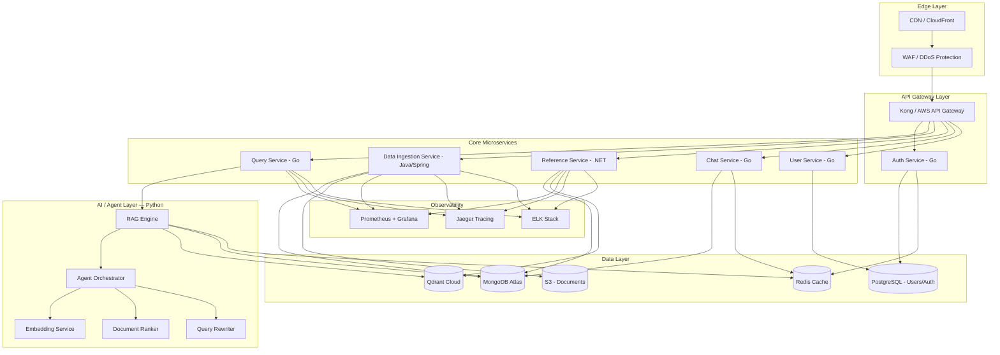
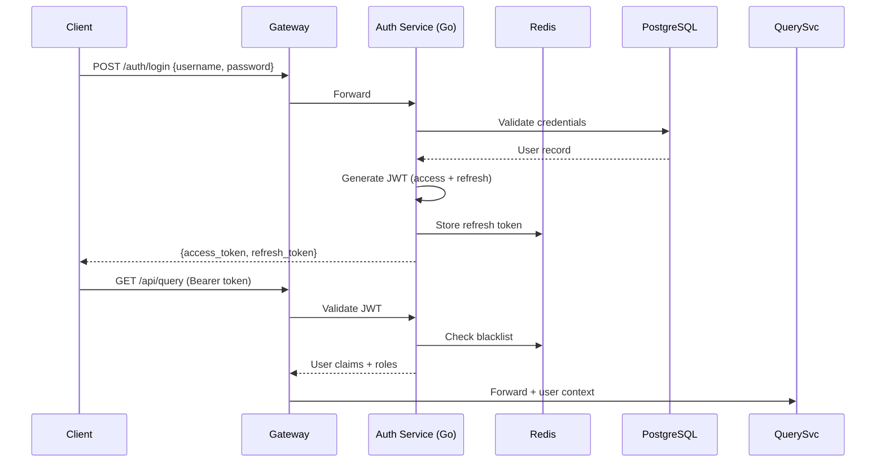
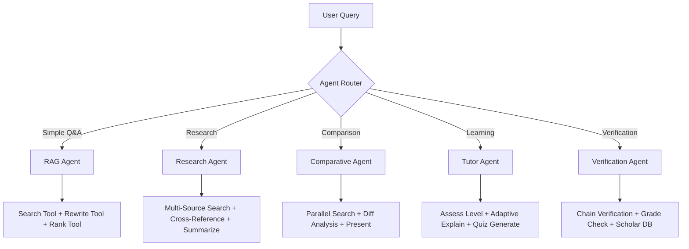
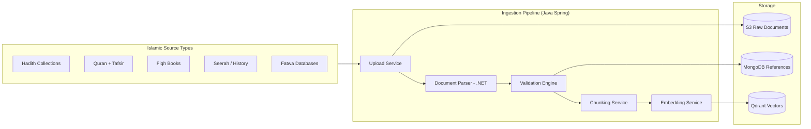

# 🕌 Mishkat Platform — Transformation Master Plan
## From RAG Monolith → Production-Grade Microservices Platform

---

## 1. Current State Analysis

### What You Have Today
| Component | Technology | Status |
|-----------|-----------|--------|
| API Server | Python FastAPI (monolith) | ✅ Working |
| Document DB | MongoDB (Motor async) | ✅ Working |
| Vector DB | Qdrant | ✅ Working |
| LLM Providers | Ollama, Google, HuggingFace, Cohere | ✅ Working |
| Embedding | BGE-M3 (1024 dims) | ✅ Working |
| Frontend | React + Vite + TailwindCSS | ✅ Basic |
| Auth | bcrypt password hashing, no JWT | ⚠️ Incomplete |
| Deployment | Docker Compose on AWS | ✅ Basic |

### Key Gaps Identified
- **No JWT/OAuth** — login returns plain user ID, comment says "JWT logic goes here later"
- **CORS wide open** — `allow_origins=["*"]`  
- **No API Gateway** — direct container access
- **No rate limiting, no audit logs, no RBAC**
- **Single monolith** — all logic in one FastAPI process
- **No caching layer** — every query hits LLM + vector DB
- **No agentic capabilities** — simple single-turn RAG only
- **Limited references** — only Bukhari + Muslim, no pipeline for new sources

---

## 2. Target Architecture



---

## 3. Technology Stack Decision

### Hybrid Microservices Strategy

| Service | Language | Why |
|---------|----------|-----|
| **API Gateway** | Kong / Envoy | Industry standard, plugin ecosystem |
| **Auth Service** | **Go** | Ultra-fast token validation, low memory footprint |
| **User Service** | **Go** | Simple CRUD, high concurrency |
| **Chat Service** | **Go** | Real-time WebSocket, streaming SSE |
| **Query Service** | **Go** | Orchestrates AI calls, handles streaming |
| **Data Ingestion** | **Java (Spring Boot)** | Robust batch processing, enterprise data validation, great for ETL pipelines |
| **Reference Service** | **.NET 8** | Rich text processing libraries, Excel/PDF parsing for Islamic manuscripts |
| **RAG Engine** | **Python** | Keep existing LangChain + Ollama + Qdrant logic |
| **Agent Orchestrator** | **Python** | LangGraph / CrewAI for agentic workflows |
| **Embedding Service** | **Python** | HuggingFace, model inference |

> [!IMPORTANT]
> **Why Hybrid?** Each language is chosen for its strength:
> - **Go** → Performance-critical, high-concurrency services (auth, chat, query routing)
> - **Java** → Enterprise-grade data pipelines, batch processing, scheduling
> - **.NET** → Rich document processing ecosystem (PDF, DOCX, Excel parsing for references)
> - **Python** → AI/ML ecosystem is unmatched (LangChain, HuggingFace, Ollama)

### Communication Patterns
| Pattern | Use Case |
|---------|----------|
| **gRPC** | Inter-service sync calls (Auth ↔ User, Query ↔ RAG) |
| **REST** | External API (client-facing) |
| **Kafka / RabbitMQ** | Async events (ingestion pipelines, embedding jobs) |
| **SSE / WebSocket** | Streaming responses to frontend |
| **Redis Pub/Sub** | Real-time notifications |

---

## 4. Security Plan

### 4.1 Authentication & Authorization



| Layer | Implementation |
|-------|---------------|
| **JWT Tokens** | RS256 signed, 15min access / 7d refresh |
| **OAuth2** | Google, GitHub, Apple Sign-In |
| **RBAC** | Roles: `admin`, `scholar`, `student`, `guest` |
| **API Keys** | For B2B integrations |
| **MFA** | TOTP (Google Authenticator) for admin/scholar |

### 4.2 Infrastructure Security

| Concern | Solution |
|---------|----------|
| **CORS** | Whitelist specific domains only |
| **Rate Limiting** | Kong plugin: 100 req/min per user, 10 req/min for guests |
| **Input Validation** | Protobuf schemas + Pydantic on Python services |
| **SQL/NoSQL Injection** | Parameterized queries, ODM/ORM only |
| **DDoS** | AWS WAF + CloudFront |
| **Secrets** | AWS Secrets Manager / HashiCorp Vault |
| **TLS** | End-to-end TLS 1.3, cert-manager for internal mTLS |
| **Audit Logging** | Every mutation logged with user, timestamp, IP |
| **Data Encryption** | AES-256 at rest, TLS in transit |
| **Container Security** | Distroless base images, non-root users, Trivy scanning |

### 4.3 Content Security (Islamic Content Specific)

| Feature | Description |
|---------|-------------|
| **Hadith Grading Filter** | Only serve authenticated (Sahih/Hasan) narrations by default |
| **Source Attribution** | Every response MUST cite book, chapter, hadith number |
| **Hallucination Guard** | Cross-validate LLM output against retrieved chunks |
| **Scholar Review Queue** | Flag uncertain responses for human scholar review |
| **Content Versioning** | Track all text changes with full audit trail |

---

## 5. Agentic AI Features

### 5.1 Agent Architecture (LangGraph-based)



### 5.2 Agent Capabilities

| Agent | Purpose | Tools |
|-------|---------|-------|
| **RAG Agent** | Standard hadith Q&A with citations | Vector search, query rewrite, doc ranking |
| **Research Agent** | Deep multi-source research | Cross-reference search, chain-of-narrators analysis, topic clustering |
| **Comparative Agent** | Compare rulings across madhabs/scholars | Parallel multi-collection search, diff analysis |
| **Tutor Agent** | Adaptive Islamic learning | Level assessment, progressive explanation, quiz generation |
| **Verification Agent** | Hadith authentication | Narrator chain (Isnad) verification, grading lookup, scholar consensus check |
| **Summarizer Agent** | Topic-based summarization | Cluster related hadiths, generate thematic summaries |

### 5.3 Agentic Workflow Example: Research Agent

```
User: "ما حكم الصيام في السفر مع الأدلة؟"

1. [Query Understanding] → Detect: research query about fasting while traveling
2. [Plan] → Need: Quranic reference + Hadith evidence + Scholar opinions
3. [Tool: Multi-Source Search] → Search Bukhari, Muslim, Abu Dawud collections
4. [Tool: Cross-Reference] → Find related Quran verses (Al-Baqarah:184-185)
5. [Tool: Scholar DB] → Fetch madhab positions (Hanafi, Maliki, Shafi'i, Hanbali)
6. [Synthesize] → Compile structured response with full citations
7. [Verify] → Cross-check claims against source texts
8. [Respond] → Structured answer with references, confidence scores
```

### 5.4 Key Agentic Features for Users

| Feature | Description |
|---------|-------------|
| **Smart Follow-ups** | Agent suggests related topics after each answer |
| **Citation Graphs** | Visual network of hadith → narrator → source relationships |
| **Confidence Scoring** | Each claim scored by evidence strength |
| **Auto-Summarization** | Long conversations summarized into study notes |
| **Multi-Turn Research** | Agent maintains research context across conversation |
| **Proactive Warnings** | Alert when a hadith has disputed grading |

---

## 6. Reference Management System

### 6.1 Expanded Reference Architecture



### 6.2 Priority References to Add

| # | Reference | Type | Language | Priority |
|---|-----------|------|----------|----------|
| 1 | صحيح مسلم (full) | Hadith | Arabic | 🔴 P0 |
| 2 | سنن أبي داود | Hadith | Arabic | 🔴 P0 |
| 3 | جامع الترمذي | Hadith | Arabic | 🔴 P0 |
| 4 | سنن النسائي | Hadith | Arabic | 🟡 P1 |
| 5 | سنن ابن ماجه | Hadith | Arabic | 🟡 P1 |
| 6 | موطأ مالك | Hadith | Arabic | 🟡 P1 |
| 7 | رياض الصالحين | Compiled | Arabic | 🟡 P1 |
| 8 | تفسير ابن كثير | Tafsir | Arabic | 🟠 P2 |
| 9 | فتح الباري | Sharh | Arabic | 🟠 P2 |
| 10 | English translations | Multi | English | 🟠 P2 |

### 6.3 Reference Data Model (Enhanced)

```json
{
  "reference_id": "bukhari",
  "reference_name": "Sahih al-Bukhari",
  "reference_arabic_name": "صحيح البخاري",
  "author": "الإمام محمد بن إسماعيل البخاري",
  "type": "HADITH_COLLECTION",
  "language": "ar",
  "total_hadiths": 7563,
  "grading_methodology": "Sahih only",
  "ingestion_status": "COMPLETE",
  "vector_collection": "bukhari_vectors",
  "last_updated": "2026-05-14T00:00:00Z",
  "metadata": {
    "volumes": 9,
    "chapters": 97,
    "has_explanation": true,
    "explanation_source": "فتح الباري"
  }
}
```

---

## 7. Microservice Specifications

### 7.1 Service Breakdown

<details>
<summary><strong>Auth Service (Go)</strong></summary>

- **Repo**: `mishkat-auth-service`
- **Framework**: Gin / Fiber
- **Database**: PostgreSQL (users, roles, sessions)
- **Cache**: Redis (tokens, blacklist)
- **Endpoints**: `/auth/register`, `/auth/login`, `/auth/refresh`, `/auth/logout`, `/auth/verify`
- **Features**: JWT RS256, OAuth2, RBAC, MFA, password policies
</details>

<details>
<summary><strong>Query Service (Go)</strong></summary>

- **Repo**: `mishkat-query-service`
- **Framework**: Gin + gRPC
- **Role**: Orchestrator — receives user queries, calls RAG Engine via gRPC, streams responses
- **Cache**: Redis (query result caching, 5min TTL)
- **Endpoints**: `/api/v1/query`, `/api/v1/query/stream`, `/api/v1/query/search`
</details>

<details>
<summary><strong>Data Ingestion Service (Java Spring Boot)</strong></summary>

- **Repo**: `mishkat-data-service`
- **Framework**: Spring Boot 3.x + Spring Batch
- **Role**: ETL pipeline — upload, validate, chunk, trigger embedding
- **Queue**: Kafka producer for embedding jobs
- **Endpoints**: `/api/v1/data/upload`, `/api/v1/data/batch`, `/api/v1/data/status`
</details>

<details>
<summary><strong>Reference Service (.NET 8)</strong></summary>

- **Repo**: `mishkat-reference-service`
- **Framework**: ASP.NET Core Minimal API
- **Role**: Manage reference sources, parse documents (PDF/DOCX/JSON)
- **Libraries**: iText7 (PDF), NPOI (Excel), System.Text.Json
- **Endpoints**: `/api/v1/ref`, `/api/v1/ref/import`, `/api/v1/ref/status`
</details>

<details>
<summary><strong>RAG Engine (Python)</strong></summary>

- **Repo**: `mishkat-rag-engine`
- **Framework**: FastAPI + LangGraph
- **Role**: AI core — embedding, retrieval, ranking, generation, agent orchestration
- **Interface**: gRPC server (called by Query Service)
- **Keeps**: All existing QueryController, VectorController, ChunkController logic
</details>

---

## 8. DevOps & Infrastructure

### 8.1 Deployment Architecture

| Environment | Infrastructure | Orchestration |
|-------------|---------------|---------------|
| **Dev** | Docker Compose (local) | Makefile |
| **Staging** | AWS ECS Fargate | Terraform |
| **Production** | AWS EKS (Kubernetes) | Helm Charts + ArgoCD |

### 8.2 CI/CD Pipeline

```
GitHub Push → GitHub Actions → Build → Test → Scan → Push Image → Deploy
                                  ↓
                          [Per-Service Pipeline]
                          - Unit Tests
                          - Integration Tests  
                          - Security Scan (Trivy)
                          - Build Docker Image
                          - Push to ECR
                          - Deploy to ECS/EKS
```

### 8.3 Observability Stack

| Tool | Purpose |
|------|---------|
| **Prometheus + Grafana** | Metrics & dashboards |
| **Jaeger** | Distributed tracing |
| **ELK Stack** | Centralized logging |
| **Sentry** | Error tracking (already in requirements) |
| **PagerDuty** | Alerting |

---

## 9. Frontend Evolution

### Current → Target

| Aspect | Current | Target |
|--------|---------|--------|
| Framework | React + Vite | Next.js 15 (App Router) |
| Styling | TailwindCSS v4 | TailwindCSS v4 + shadcn/ui |
| State | Local state | Zustand + TanStack Query |
| Auth | Simple user ID | NextAuth.js + JWT |
| Streaming | Basic SSE | Vercel AI SDK |
| i18n | None | next-intl (Arabic RTL + English) |
| Design | Basic chat | Premium Islamic-themed dashboard |

### New Pages/Features
- 🏠 Landing page with project showcase
- 📚 Reference library browser
- 💬 Advanced chat with citation cards
- 🔍 Semantic search explorer
- 📊 Admin dashboard (ingestion, analytics)
- 👤 User profile + saved research
- 🎓 Learning paths (Tutor Agent UI)
- 📱 PWA + Mobile responsive

---

## 10. Implementation Roadmap

### Phase 1: Foundation (Weeks 1-4)
- [ ] Set up monorepo structure
- [ ] Auth Service (Go) with JWT + RBAC
- [ ] API Gateway (Kong)
- [ ] PostgreSQL for users, Redis for caching
- [ ] Migrate existing Python RAG into standalone service
- [ ] Basic CI/CD with GitHub Actions

### Phase 2: Core Services (Weeks 5-8)
- [ ] Query Service (Go) — orchestrator with streaming
- [ ] Chat Service (Go) — WebSocket support
- [ ] Data Ingestion Service (Java) — batch pipeline
- [ ] Reference Service (.NET) — document parsing
- [ ] gRPC contracts between services
- [ ] Kafka for async processing

### Phase 3: AI & Agents (Weeks 9-12)
- [ ] LangGraph agent orchestrator
- [ ] Research Agent + Comparative Agent
- [ ] Tutor Agent with adaptive learning
- [ ] Verification Agent (Isnad checking)
- [ ] Confidence scoring system
- [ ] Hallucination guard

### Phase 4: References & Content (Weeks 13-16)
- [ ] Ingest Kutub al-Sittah (6 major collections)
- [ ] Add Tafsir sources
- [ ] Cross-reference linking
- [ ] Narrator database (Rijal)
- [ ] Source quality scoring

### Phase 5: Frontend & Polish (Weeks 17-20)
- [ ] Next.js migration
- [ ] Premium Islamic design system
- [ ] Citation graph visualization
- [ ] Admin dashboard
- [ ] PWA + mobile optimization
- [ ] Full Arabic RTL support

### Phase 6: Production (Weeks 21-24)
- [ ] Kubernetes deployment (EKS)
- [ ] Load testing + performance tuning
- [ ] Security audit + penetration testing
- [ ] Monitoring + alerting
- [ ] Documentation + API portal
- [ ] Beta launch

---

## 11. Repository Structure

```
mishkat-platform/
├── services/
│   ├── auth-service/          # Go
│   ├── query-service/         # Go
│   ├── chat-service/          # Go
│   ├── user-service/          # Go
│   ├── data-service/          # Java Spring Boot
│   ├── reference-service/     # .NET 8
│   └── rag-engine/            # Python (existing + agents)
├── frontend/                  # Next.js
├── gateway/                   # Kong config
├── proto/                     # Shared Protobuf definitions
├── infra/
│   ├── terraform/             # AWS infrastructure
│   ├── helm/                  # Kubernetes charts
│   └── docker/                # Docker Compose (dev)
├── docs/                      # Architecture Decision Records
└── scripts/                   # Automation scripts
```

---

## 12. Key Decisions Needed From You

> [!IMPORTANT]
> Before starting implementation, I need your input on these decisions:

1. **Cloud Provider** — AWS (recommended), GCP, or Azure?
2. **Monorepo vs Multi-repo** — Single repo or separate repos per service?
3. **Phase priority** — Start with Security first or AI Agents first?
4. **LLM Strategy** — Keep self-hosted Ollama or move to cloud APIs (Google, OpenAI)?
5. **Budget constraints** — This affects infra choices (ECS vs EKS, managed vs self-hosted)
6. **Team size** — How many developers? This affects which services to build first
7. **Which references** to prioritize for ingestion?
8. **Frontend** — Keep React SPA or migrate to Next.js?
